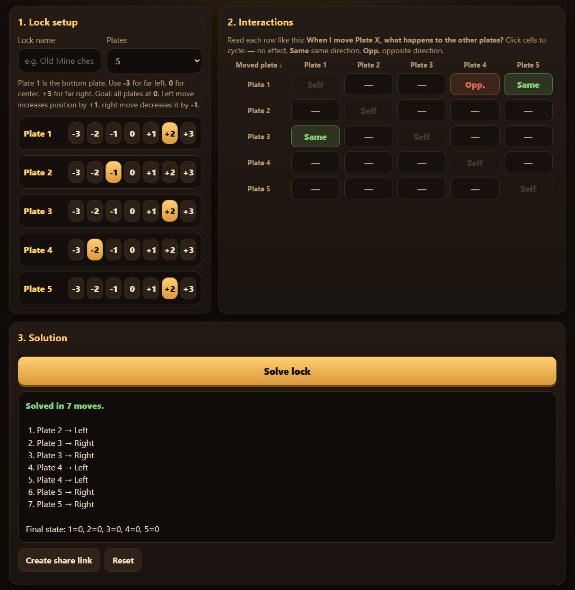

# Gothic Remake Lockpick Solver

Free online lockpicking puzzle solver for Gothic Remake.

🔓 Launch App:  
https://gothic-remake-lockbreaker.com

---

## Screenshot

---

## Features

- Supports 1-7 plate locks
- Finds the shortest valid solution
- Mobile friendly
- Shareable lock URLs
- Runs entirely in your browser
- No registration required

---

## How to use

1. Select the number of plates
2. Set plate positions
3. Define plate interactions
4. Click **Solve Lock**

---

## Keywords

- Gothic Remake lockpick solver
- Gothic Remake lockpicking puzzle solver
- Gothic Remake lock solution
- Gothic Remake lock helper
- Gothic Remake lockpicking guide
- Gothic Remake lock breaker
- Gothic Remake lock puzzle solver

---

## Disclaimer

Gothic Remake Lockbreaker is a fan-made project and is not affiliated with, endorsed by, or sponsored by Alkimia Interactive, THQ Nordic, or the Gothic Remake development team.

"Gothic" and "Gothic Remake" are trademarks of their respective owners.
